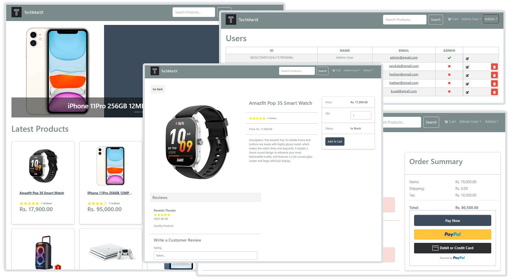
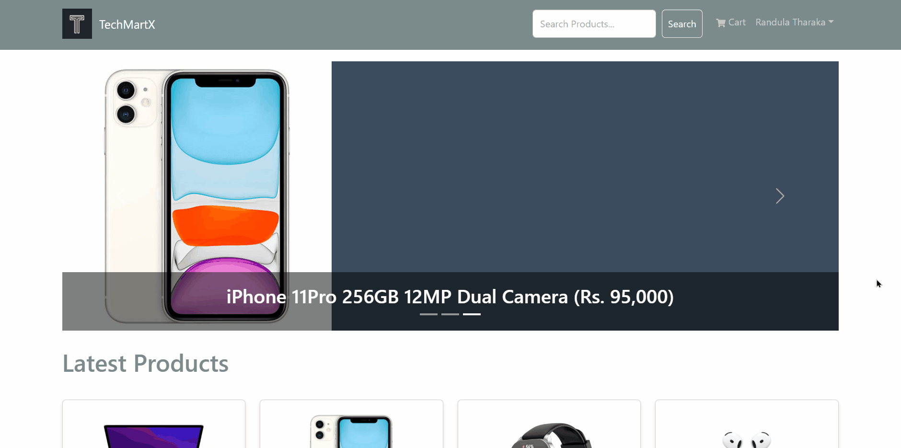
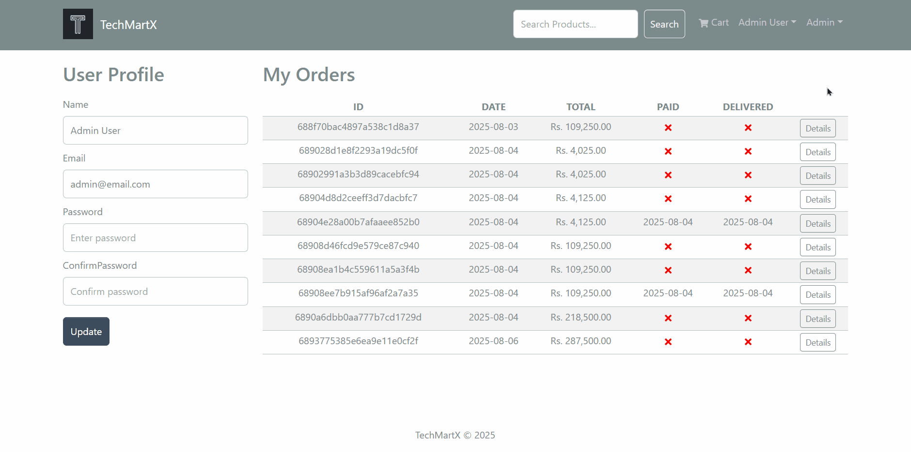

# 💻 TechMartX – MERN Stack e-commerce Platform

> TechMartX is an e-commerce web application for buying and selling tech products.

🛒 Live Demo: [www.techmartx.com](https://www.techmartx.com)



## 🚀 Project Overview

TechMartX allows users to browse, search, and purchase technology products online.  
It includes features such as user authentication, product management, shopping cart functionality, order processing, and an admin dashboard.

## 🎯 Why I Built This

I built TechMartX as the final project for a 3-month MERN Stack Course at the University of Colombo, as well as part of my personal learning journey to deepen my skills in JavaScript-based full-stack web development.

Note that throughout the project, I thoroughly documented the code with comments to reinforce my understanding of key concepts.

## 🧠 Developer Notes

I've included a set of personal notes I created while learning and building this project.  
They cover some foundational concepts in React, Redux, JavaScript and other Technologies used along with code explanations and architectural thoughts.

📄 [View Developer Notes PDF](docs/TechMartX_DeveloperNotes.pdf)

Note that this is a raw, working document created during my learning process - not a finalized guide.

## 🛠️ Tech Stack

- **Frontend:** React, Redux Toolkit, React Bootstrap, React Router
- **Backend:** Node.js, Express.js
- **Database:** MongoDB (hosted on MongoDB Atlas)
- **Other Tools & Concepts:** JWT Authentication, RESTful APIs, Postman, MongoDB Compass

## ✨ Features

- User registration and authentication (JWT)
- Shopping cart with quantity control
- Product listing with search & filter
- Checkout and PayPal payment integration
- Product reviews and customer ratings
- Order history and user profile management
- Admin dashboard to manage products, users, and orders
- Top products carousel & product pagination
- Responsive layout for mobile, tablet, and desktop

## ▶️ Feature Demos

### 🛒 Cart and Checkout Flow



### 🛠️ Admin Panel



## 📦 Installation

1. Create a MongoDB database and obtain your `MongoDB URI` - [MongoDB Atlas](https://www.mongodb.com/cloud/atlas/register)

2. Create a PayPal account and obtain your `Client ID` - [PayPal Developer](https://developer.paypal.com/)

3. **Clone the repository:**

   ```sh
   git clone https://github.com/RandulaTharaka/TechMartX.git

   ```

4. **Install dependencies for both frontend and backend:**
   ```sh
   cd TechMartX
   npm install
   cd frontend
   npm install
   ```
5. **Set up environment variables:**  
   Rename the `.env.example` file to `.env` and add the following

   ```env
   NODE_ENV=development
   PORT=5000

   MONGO_URI=your_mongodb_uri
   JWT_SECRET=abc123

   PAYPAL_CLIENT_ID=your_paypal_client_id
   PAYPAL_APP_SECRET=your_paypal_app_secret
   PAYPAL_API_URL=https://api-m.sandbox.paypal.com

   PAGINATION_LIMIT=8
   ```

6. **Start the development servers:**

   ```sh
   # Run frontend (:3000) & backend (:5000)
   npm run dev
   # Run backend only
   npm run server
   ```

7. **Build & Deploy**

```sh
   # Create frontend production build
   cd frontend
   npm run build
```

## 📚 API Documentation

The backend exposes RESTful endpoints for products, users, orders, and authentication.

- **GET /api/products** — List all products
- **GET /api/products/:id** — Get product details
- **POST /api/users/login** — User login
- **POST /api/orders** — Create a new order
- **GET /api/orders/:id** — Get order details

_See the codebase for more endpoints and usage._

## 📄 License

This project is open source and available under the [MIT License](LICENSE).

## 🤝 Connect With Me

I'm passionate about building full-stack applications and always open to meaningful collaborations, feedback, and new opportunities in software development.

Feel free to connect or reach out!
