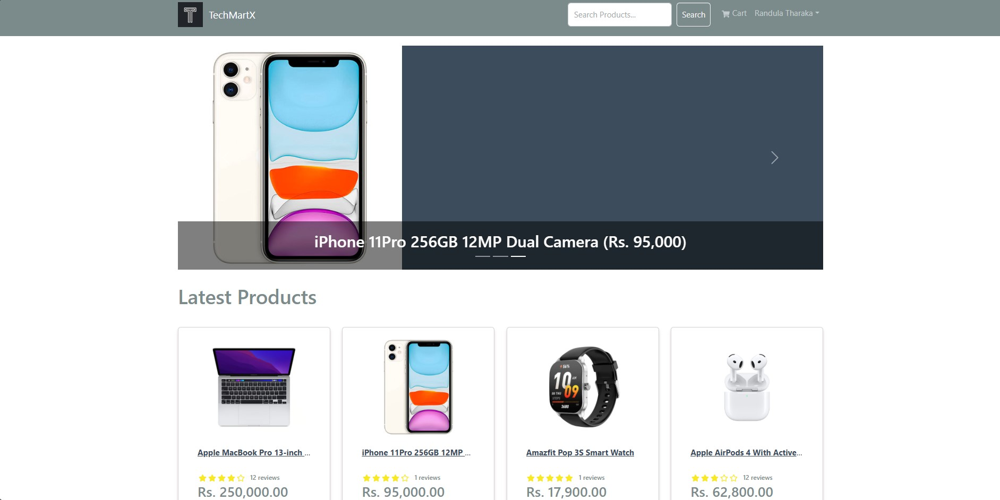
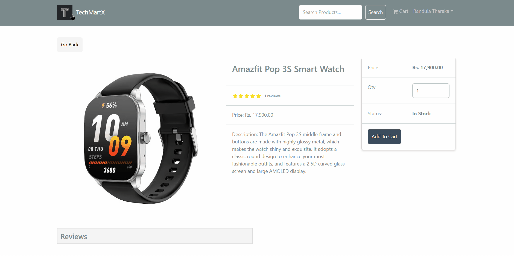

# 💻 TechMartX – MERN Stack E-commerce Platform

**TechMartX is a full-featured e-commerce application for buying and selling tech products.**

🛒 Live Demo: [www.techmartx.com](https://www.techmartx.com)  
📦 Built with the MERN Stack (MongoDB, Express, React, Node.js)

## 🚀 Project Overview

TechMartX allows users to browse, search, and purchase technology products online.  
It includes features such as user authentication, product management, shopping cart functionality, order processing, and an admin dashboard.

## 🎯 Why I Built This

I built TechMartX as the final project for a 3-month MERN stack course at the University of Colombo, as well as part of my personal learning journey to deepen my skills in full-stack web development.

Beyond meeting course requirements, I focused on truly understanding how modern JavaScript technologies work from frontend architecture with React and Redux Toolkit to backend APIs with Node.js and MongoDB.

Throughout the project, I thoroughly documented the code with comments to reinforce my understanding of key concepts such as component logic, API integration, state management, and user authentication.

## 🧠 Developer Notes

I've included a set of personal notes I created while learning and building this project.  
They cover some foundational concepts in React, Redux, JavaScript and other Technologies used along with code explanations and architectural thoughts.

📄 [View Developer Notes PDF](docs/TechMartX_DeveloperNotes.pdf)

Note that this is a raw, working document created during my learning process - not a finalized guide.

## 🛠️ Tech Stack

- **Frontend:** React, Redux Toolkit, React Bootstrap, React Router
- **Backend:** Node.js, Express.js
- **Database:** MongoDB (hosted on MongoDB Atlas)
- **Other Tools & Concepts:** JWT Authentication, RESTful APIs, Postman, MongoDB Compass

## ✨ Key Features

- ✅ User registration and authentication (JWT)
- 🛍️ Product listing with search and filter
- 🛒 Shopping cart with quantity control
- 💳 Checkout and PayPal payment integration
- 🗣️ Product reviews and customer ratings
- 📦 Order history and user profile management
- 🛠️ Admin dashboard to manage products, users, and orders
- 📱 Fully responsive layout for mobile, tablet, and desktop

## 📸 Screenshots

### 🏠 Home Page



### 🛒 Product Page



### 📦 Cart and Checkout Flow


### 🛠️ Admin Panel


_or embed a GIF like this:_


## 📦 Installation

1. **Clone the repository:**

   ```sh
   git clone https://github.com/RandulaTharaka/TechMartX.git

   ```

2. **Install dependencies for both frontend and backend:**
   ```sh
   cd TechMartX
   npm install
   cd frontend
   npm install
   ```
3. **Set up environment variables:**  
   Copy the `.env.example` file to `.env` and fill in the required values:

   ```env
   NODE_ENV=development
   PORT=desired_port

   MONGO_URI=your_mongodb_uri
   JWT_SECRET=your_jwt_secret

   PAYPAL_CLIENT_ID=your_paypal_client_id
   PAYPAL_APP_SECRET=your_paypal_app_secret
   PAYPAL_API_URL=https://api-m.sandbox.paypal.com

   PAGINATION_LIMIT=8
   ```

4. **Start the development servers:**
   ```sh
   npm run dev
   ```

## 📚 API Documentation

The backend exposes RESTful endpoints for products, users, orders, and authentication.

- **GET /api/products** — List all products
- **GET /api/products/:id** — Get product details
- **POST /api/users/login** — User login
- **POST /api/orders** — Create a new order
- **GET /api/orders/:id** — Get order details

_See the codebase for more endpoints and usage._

## 📄 License

This project is open source and available under the [MIT License](LICENSE).

## 🤝 Connect With Me

I'm passionate about building full-stack applications and always open to meaningful collaborations, feedback, and new opportunities in software development.

Feel free to connect or reach out!
